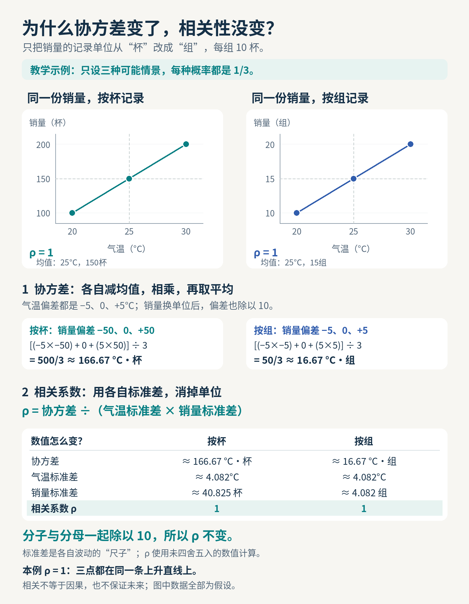
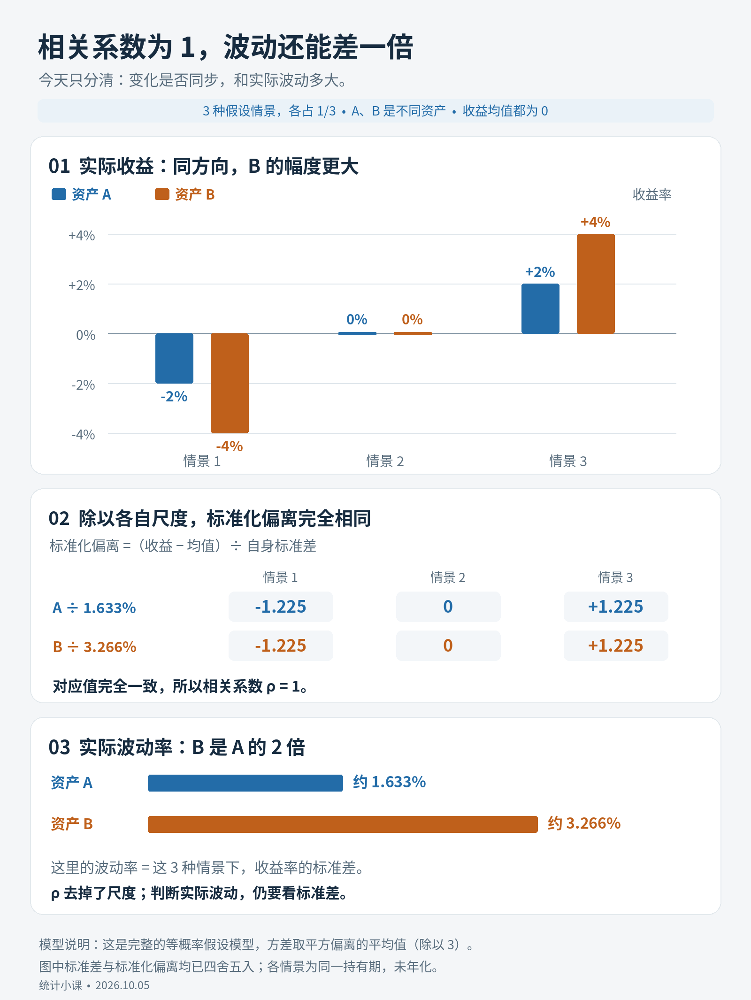
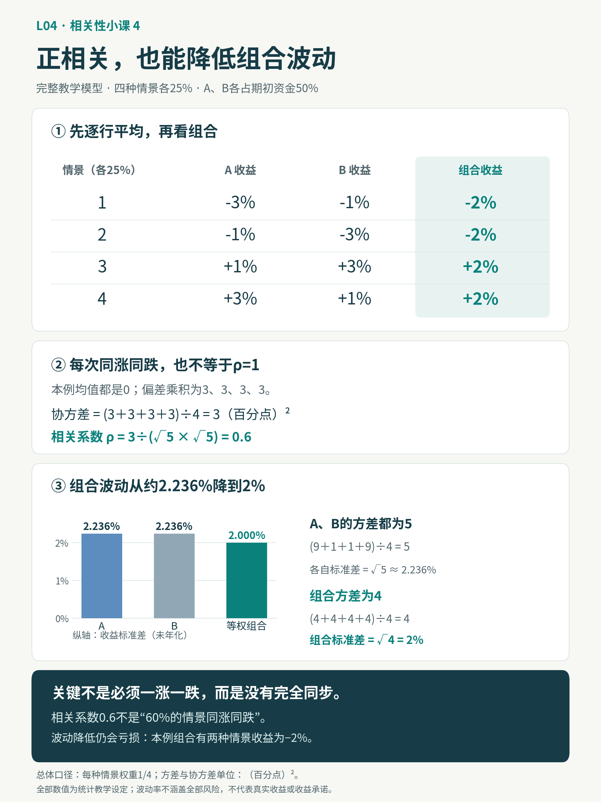

# L04 协方差、相关性与组合风险

<!-- 网站正文的可读源文件。保留原有锚点、实验链接与折叠答案；数学公式按原课使用 LaTeX。 -->

> <div class="callout-title">
>
> 先从三天冷饮摊开始
>
> </div>
>
> 协方差想回答的是：**一个量高于它自己的平均水平时，另一个量也倾向于高于自己的平均水平吗？**先不用背公式，也不用懂矩阵。我们只用平均数、减法、乘法和除法，把它一步步算出来。
>
> <a href="#/lab/covariance" class="button">打开协方差入门实验</a>　用同一组三天数据，边读边看每一步如何改变结果。

<a id="covariance-route"></a>

## 第一次学：按这条路线读

1.  先读“二、协方差”，从温度和销量的故事开始。
2.  依次做四件事：**求各自平均数 → 算各自偏差 → 同一天的偏差相乘 → 加起来再除**。
3.  在实验中比较同向、反向和 U 型数据，再完成“入门自测”。
4.  能解释正、负、零与单位，就已完成第一轮。接下来可读四节相关性小课；组合公式和矩阵仍保留为折叠进阶阅读，可以以后再展开。

<a id="section-1"></a>

## 一、本课目标

- 用自己的话说清协方差在比较什么，尤其是“各自的平均水平”。
- 手算三天数据，理解“两个负偏差相乘也是正数”。
- 区分总体除以天数与样本估计除以“天数减一”，并说明结果的单位。
- 知道零协方差不等于没有任何关系，正协方差也不保证赚钱。

<details class="callout callout-example"><summary>进阶目标：第一轮可以跳过</summary>

- 理解协方差、Pearson/Spearman 相关及其差异；
- 推导两资产和多资产组合方差；
- 建立、检查并使用协方差矩阵；
- 识别滚动相关、异步交易和共同市场暴露造成的误判；
- 理解为什么样本协方差在高维组合中不稳定。

</details>

<a id="section-2"></a>

## 二、协方差：把共同偏离算出来

你在冷饮摊记录了三天的温度和销量。每行必须是**同一天的一对数据**；把温度和销量分别排序再配对，会改变我们研究的关系。

[协方差入门实验](#/lab/covariance)与下面的例子使用同样的数据。先读懂一行，再观察整个结果。

<a id="covariance-step-1"></a>

### 第 1 步：先看数据，求各自的平均数

<div class="table-wrap">

| 日期    | 温度（℃） | 销量（支） |
|---------|-----------|------------|
| 第 1 天 | 20        | 100        |
| 第 2 天 | 25        | 150        |
| 第 3 天 | 30        | 200        |

三天的温度和冷饮销量

</div>

平均温度 =（20 + 25 + 30）÷ 3 = **25℃**。

平均销量 =（100 + 150 + 200）÷ 3 = **150 支**。

不要直接拿“20”和“100”比较，也不要先比较今天与昨天。这里问的是：**每一天的温度比平均温度高还是低？同一天的销量比平均销量高还是低？**

<a id="covariance-step-2"></a>

### 第 2 步：每个数减去自己的平均数

“偏差”（也叫离差）就是**实际值 − 自己的平均数**。负号只表示低于平均水平，并不表示温度低于 0℃，更不表示销量为负。

<div class="table-wrap">

| 日期    | 温度偏差（℃） | 销量偏差（支）  | 用一句话读懂           |
|---------|---------------|-----------------|------------------------|
| 第 1 天 | 20 − 25 = −5  | 100 − 150 = −50 | 偏冷，而且卖得偏少     |
| 第 2 天 | 25 − 25 = 0   | 150 − 150 = 0   | 两个量都等于各自平均数 |
| 第 3 天 | 30 − 25 = +5  | 200 − 150 = +50 | 偏热，而且卖得偏多     |

分别与自己的平均水平比较

</div>

第 1 天的销量仍是 100 支，只是比平均销量少 50 支。这是“销量偏差为负”的意思。

<a id="covariance-step-3"></a>

### 第 3 步：把同一天的两个偏差相乘

我们用乘积把“是否同向偏离”和“偏离多大”记录在一个数里：

<div class="table-wrap">

| 日期    | 温度偏差 × 销量偏差 | 乘积（℃·支） | 为什么是这个符号？                 |
|---------|---------------------|--------------|------------------------------------|
| 第 1 天 | （−5）×（−50）      | +250         | 负 × 负 = 正：两者都低于各自平均数 |
| 第 2 天 | 0 × 0               | 0            | 在平均水平上，没有偏离贡献         |
| 第 3 天 | （+5）×（+50）      | +250         | 正 × 正 = 正：两者都高于各自平均数 |

每一天对协方差的贡献

</div>

> <div class="callout-title">
>
> 最关键的一步：负负也算同向
>
> </div>
>
> “共同偏离”包含**一起高于平均，也一起低于平均**。第 1 天虽然两个偏差都是负数，但它们方向相同，所以乘积为正。若一个高于平均、另一个低于平均，正负相乘才会得到负数。

乘积还保留了幅度：偏差越大，贡献可能越大。最后要**把带正负号的乘积加起来**，不是数一数有几天同向、几天反向。一次很大的反向偏离，可能抵消多次很小的同向偏离。

<a id="covariance-step-4"></a>

### 第 4 步：加总，再按口径除

三天的偏差乘积之和 = 250 + 0 + 250 = **500 ℃·支**。

**总体口径：**若我们只想描述这三天，把它们看作全部数据且每一天等权，就除以 3：

总体协方差 = 500 ÷ 3 ≈ **166.6667 ℃·支**。

结果为正，表示这组三天数据总体上呈同向偏离平均水平的趋势。它不是“每升高 1℃就多卖 166.6667 支”；那是另一个问题，需要斜率等工具。

**样本估计口径：**若这三天只是从更多日子里抽出的样本，要用常见的样本协方差估计总体，就除以 3 − 1 = 2：

样本协方差 = 500 ÷ 2 = **250 ℃·支**。

两种算法使用**同一组偏差、同一个乘积总和**，只改变最后的分母。请先看题目要求哪一种口径；除以 n 或 n − 1 都不会改变这个例子的正负号。样本至少要有两对数据才能使用 n − 1。

<details class="callout callout-example"><summary>为什么样本估计常除以 n − 1？（可后读）</summary>

样本平均数也是用这批数据算出来的，会让围绕它计算的共同偏离在平均意义上偏小。在独立同分布且相关二阶矩存在的通常假设下，除以 n − 1 能得到总体协方差的无偏估计。若只是描述当前这批数据，除以 n 也有明确意义。时间序列等场景还需要检查这些假设。

</details>

<a id="covariance-negative"></a>

### 换一个故事：偏热时反而卖得少

温度仍为 20、25、30℃，销量改为 **200、150、100 支**。平均温度仍是 25℃，平均销量仍是 150 支。

<div class="table-wrap">

| 日期    | 温度偏差（℃） | 销量偏差（支） | 乘积（℃·支） |
|---------|---------------|----------------|--------------|
| 第 1 天 | −5            | +50            | −250         |
| 第 2 天 | 0             | 0              | 0            |
| 第 3 天 | +5            | −50            | −250         |

反向偏离：一个高于平均，另一个低于平均

</div>

总和 = −250 + 0 − 250 = **−500 ℃·支**。总体协方差 = −500 ÷ 3 ≈ **−166.6667 ℃·支**；样本协方差 = −500 ÷ 2 = **−250 ℃·支**。

负协方差表示反向偏离的贡献占上风：温度偏高时销量偏低，温度偏低时销量偏高。它不是说温度或销量本身是负数。

<a id="covariance-zero"></a>

### 再看零：有 U 型关系，协方差也能为零

温度仍为 20、25、30℃，销量换成 **200、100、200 支**。现在温度低和高时销量都高，中间反而低，呈 U 型。平均温度是 25℃，平均销量 = 500 ÷ 3 ≈ **166.6667 支**。

<div class="table-wrap">

| 日期    | 温度偏差（℃） | 销量偏差（支，约） | 乘积（℃·支，约） |
|---------|---------------|--------------------|------------------|
| 第 1 天 | −5            | +33.3333           | −166.6667        |
| 第 2 天 | 0             | −66.6667           | 0                |
| 第 3 天 | +5            | +33.3333           | +166.6667        |

U 型例子：正、负线性贡献恰好抵消

</div>

保留精确分数计算时，乘积是 −500/3、0、+500/3，总和恰好为 0，所以总体和样本协方差都为 **0**。表中小数只是显示时的四舍五入。

> <div class="callout-title">
>
> 零协方差不等于没有关系
>
> </div>
>
> 这里的线性贡献抵消了，但销量与温度明显呈 U 型关系。协方差衡量的是**线性共同变化**；零协方差不能推出独立，也不能排除非线性关系。面对数据，应同时看散点图和背景，不能只读一个数。

<a id="covariance-meaning"></a>

### 最后检查：这个数能说什么，不能说什么？

- **正、负、零：**分别对应同向贡献占上风、反向贡献占上风、线性贡献的总和为零（可能是正负抵消）；都要相对于各自均值解释。
- **单位：**温度用℃，销量用支，乘积和协方差的单位就是 ℃·支。若销量改用“百支”，所有销量偏差缩小到原来的 1/100，协方差也缩小到 1/100，关系本身却没有变。因此协方差大小不能脱离单位直接比较。
- **并非因果：**温度与销量一起变化，不足以证明只靠升温就能增加销量，还可能受营业时间、节假日等影响。
- **并非利润：**正协方差描述共同偏离，不代表销量一定高、策略收益一定为正，更不保证赚钱。两种资产可以一起亏损而仍呈正协方差。
- **并非“多数天投票”：**加总的是偏差乘积及其大小，不是正乘积和负乘积各有几天。

现在回到[协方差入门实验](#/lab/covariance)：先预测同向、反向、U 型的符号，再逐步查看偏差和乘积；最后切换总体/样本口径，观察分母改变了什么。

<details class="callout callout-example"><summary>看懂故事后再看公式：与上面的四步一一对应</summary>

下式中的 X 和 Y 就像温度与销量；μ 是总体平均数，带横线的平均数由样本计算；Σ 表示把每一对偏差乘积加起来，E 表示按概率取平均。下面保留总体与样本的正式写法。

总体协方差：

$$
Cov(X,Y)=E[(X-\mu_X)(Y-\mu_Y)]
$$

样本协方差：

$$
s_{XY}=\frac{1}{n-1}\sum_{t=1}^{n}(X_t-\bar X)(Y_t-\bar Y)
$$

- 正值：两者倾向同向偏离均值；
- 负值：倾向反向偏离；
- 接近零：没有明显线性共同变化，但仍可能存在非线性依赖。

协方差受单位影响，难以直接比较。

</details>

<a id="covariance-practice"></a>

## 入门自测：先想，再展开答案

不必背公式。能用“平均水平、偏差、乘积、加总”解释清楚，就可以继续。

**自测 A：**20℃、100 支这一行，温度偏差和销量偏差为什么都为负？它对协方差的贡献为什么为正？

<details class="callout callout-example"><summary>查看自测 A 答案</summary>

温度比 25℃低 5℃，销量比 150 支少 50 支，所以偏差为 −5 和 −50。两者都低于各自平均数，属于同向偏离；（−5）×（−50）= +250 ℃·支。

</details>

**自测 B：**同向例子的乘积总和为 500 ℃·支。把三天当作全部数据和当作样本估计时，各除以多少？

<details class="callout callout-example"><summary>查看自测 B 答案</summary>

总体口径除以 3，结果约 166.6667 ℃·支；常见样本估计口径除以 2，结果 250 ℃·支。偏差与总和相同，分母不同。

</details>

**自测 C：**销量换成 200、150、100 支，协方差是什么符号？这个符号是不是表示销量为负？

<details class="callout callout-example"><summary>查看自测 C 答案</summary>

乘积为 −250、0、−250，总体协方差约 −166.6667 ℃·支，样本协方差为 −250 ℃·支。负号表示反向偏离；三个实际销量仍全部为正。

</details>

**自测 D：**销量为 200、100、200 支时，协方差为零。能说销量与温度毫无关系或相互独立吗？

<details class="callout callout-example"><summary>查看自测 D 答案</summary>

不能。这组三点呈 U 型，正负线性贡献抵消为零。零协方差不能排除非线性关系，也不能推出独立。

</details>

**自测 E：**把销量单位从“支”改成“百支”，协方差会不会变？温度与销量的实际关系有没有因此改变？

<details class="callout callout-example"><summary>查看自测 E 答案</summary>

数值变为原来的 1/100，单位变成 ℃·百支；同向例子的总体协方差约为 1.6667 ℃·百支。实际关系没有改变。协方差有单位，因此绝对大小不能直接跨单位比较。

</details>

**自测 F：**有 6 天的偏差乘积为正、4 天为负，协方差就一定为正吗？

<details class="callout callout-example"><summary>查看自测 F 答案</summary>

不一定。要加总乘积的实际数值。4 个负乘积的绝对值总和可能更大，抵消 6 个正乘积后仍为负。

</details>

> <div class="callout-title">
>
> 第一轮到这里就够了
>
> </div>
>
> 能解释上述例子，并独立完成实验，就已经掌握协方差的入门直觉。下面用四节短课连接相关系数、波动率与权重，再保留原课的全部进阶主题，按需展开。遇到矩阵或 Python，不必因此停下今天的学习。

<section class="cor-daily" aria-labelledby="correlation-units">
<h2 id="correlation-units">相关性小课 1：换单位，不换关系</h2>
<p class="cor-date">2026-10-04 · 约 6 分钟 · 接在协方差入门之后</p>
<p>已经会“各自减均值 → 同一情景的偏差相乘 → 取平均”，就只往前走一小步：<strong>为什么协方差会因单位变化，而相关系数不变？</strong></p>
<p>这次重新设一个完整的教学模型：只可能出现三种情景，每种概率都是 1/3。温度为 20、25、30℃，冷饮销量为 100、150、200 杯。它们不是随机抽到的三个交易日或营业日，所以下面计算总体量时除以 3。</p>
<figure class="cor-figure"><a href="../../assets/images/correlation-unit-invariance.png" target="_blank" rel="noopener"></a><figcaption>同一份销量，只改变记录单位。点图可看原图；完整数值和计算在下文。</figcaption></figure>
<h3 id="correlation-units-deviations">先回到各自的均值</h3>
<p>温度均值是 25℃，销量均值是 150 杯。温度偏差为 −5、0、+5℃；销量偏差为 −50、0、+50 杯。三次偏差乘积是 250、0、250 ℃·杯，所以协方差 = 500 ÷ 3 ≈ <strong>166.67 ℃·杯</strong>。</p>
<p>现在每 10 杯记成 1 组，销量变为 10、15、20 组，均值为 15 组，偏差为 −5、0、+5 组。乘积变为 25、0、25 ℃·组，协方差 = 50 ÷ 3 ≈ <strong>16.67 ℃·组</strong>。卖出的冷饮一杯没变，数值和单位却都变了。</p>
<h3 id="correlation-units-standardize">再用标准差消掉尺度</h3>
<p>标准差是各自波动的“尺子”：先把偏差平方，按情景概率取平均，再开平方。温度标准差 = √(50/3) ≈ 4.082℃；销量标准差按杯算是 √(5000/3) ≈ 40.825 杯，按组算是 √(50/3) ≈ 4.082 组。</p>
<p class="cor-formula"><strong>相关系数 ρ = 协方差 ÷（温度标准差 × 销量标准差）</strong></p>
<p>ρ 读作 rho（柔）。把销量换成组，分子与分母都除以 10，因此 ρ 不变，仍然是 1。计算使用未四舍五入的值，显示的小数只是为了易读。</p>
<div class="cor-interactive" data-correlation-demo="units"></div>
<p><strong>小练习：</strong>温度不变，销量改为 200、150、100 杯。ρ 会是 +1、0，还是 −1？先写出第一种情景的两个偏差。</p>
<details class="callout callout-example" id="cor-units-answer"><summary>查看“反向销量”答案</summary><p>第一种情景偏差为 −5℃和 +50 杯，乘积为 −250 ℃·杯。三次乘积是 −250、0、−250，协方差为 −500/3；标准差的乘积仍为 +500/3，所以 <strong>ρ = −1</strong>。改成每组 10 杯后，分子和分母同样缩小 10 倍，ρ 仍为 −1。</p></details>
<p>这一步只记住：<strong>正数倍换单位不改变相关系数。</strong>加一个常数改变均值，也不改变偏差的关系。若把一个变量乘以负数，则方向翻转，ρ 也变号；那不属于这里的正比例单位换算。</p>
<ul><li>任一变量的标准差为 0 时，通常的 Pearson 相关系数没有定义。</li><li>ρ = +1 或 −1 要求偏差呈固定的正比例或负比例，也就是点精确落在上升或下降直线上；仅仅“大多数时候同向”还不够。</li><li>ρ = 0 只表示零线性相关，不能推出独立；相关也不说明因果。</li></ul>
<p><a href="#/lab/covariance">还想练“均值 → 偏差 → 乘积”？回到协方差实验 →</a></p>
</section>
<section class="cor-daily" aria-labelledby="correlation-volatility">
<h2 id="correlation-volatility">相关性小课 2：ρ = 1，波动为什么还能差一倍？</h2>
<p class="cor-date">2026-10-05 · 约 7 分钟 · 接在“换单位”之后</p>
<p>相关系数消掉了各自的波动尺度。因此，<strong>两个不同资产即使 ρ = 1，实际涨跌幅也可以不同。</strong>这次比较的是两个资产，不是给同一个资产换单位。</p>
<blockquote class="callout"><div class="callout-title">教学示例，无收益承诺</div><p>假设同一持有期只有三种可能情景，各占 1/3。A 的收益率是 −2%、0、+2%；B 是 −4%、0、+4%。这是一套完整假设模型，不是三个交易日的样本；数值未年化，不代表真实资产或投资建议。</p></blockquote>
<figure class="cor-figure"><a href="../../assets/images/correlation-volatility.png" target="_blank" rel="noopener"></a><figcaption>看图顺序：实际收益 → 除以自己的标准差 → 比较真实波动。点图可看原图。</figcaption></figure>
<h3 id="correlation-volatility-standardize">为什么标准化以后完全一样？</h3>
<p>两者均值都是 0，所以本例的收益就是离各自均值的偏离。以百分点为数值单位，A 的偏差是 −2、0、+2，B 是 −4、0、+4。第一种情景，A 比自己的均值低 2 个百分点，B 比自己的均值低 4 个百分点。</p>
<p>A 的标准差 = √[(4 + 0 + 4) ÷ 3] = √(8/3) 个百分点 ≈ <strong>1.633 个百分点（1.633%）</strong>；B 的标准差 = √[(16 + 0 + 16) ÷ 3] = √(32/3) 个百分点 ≈ <strong>3.266 个百分点（3.266%）</strong>。B 恰好是 A 的两倍。</p>
<p>只算第一格：A 为 −2 ÷ 1.633 ≈ −1.225；B 为 −4 ÷ 3.266 ≈ −1.225。意思是：它们都比自己的均值低约 1.225 个“自身标准差”。中间一格都是 0，最后一格都是 +1.225，所以两排标准化偏离完全一致。</p>
<p><strong>接回协方差：</strong>三次偏差乘积为 8、0、8，协方差是 16/3 平方百分点；两个标准差的乘积也是 16/3 平方百分点。相除得到 <strong>ρ = 1</strong>。等式按精确值成立，不是用显示的近似数硬凑出来。</p>
<p>ρ = 1 表示偏差呈固定正比例，不要求每次收益一样大，也不要求平均收益相同。本例把均值都设为 0，只是方便看清。</p>
<h3 id="correlation-volatility-portfolio">各买一半，是否一定更平稳？</h3>
<p>A、B 各占期初资金的一半，每个情景的组合收益都是两者的平均：<strong>−3%、0、+3%</strong>。组合标准差 = √[(9 + 0 + 9) ÷ 3] = √6 个百分点 ≈ <strong>2.449 个百分点（2.449%）</strong>，比只持有 A 更大。持有两项资产，并不自动更平稳。</p>
<p><strong>小练习：</strong>把 B 换成 C，收益为 +4%、0、−4%，它与 A 的相关系数为 −1。A、C 各占一半，三个情景的组合收益都会是 0 吗？先只算第一种情景。</p>
<details class="callout callout-example" id="cor-volatility-answer"><summary>查看“负相关也未必归零”答案</summary><p>不会。第一种情景：（−2% + 4%）÷ 2 = +1%；中间为 0；第三种情景：（2% − 4%）÷ 2 = −1%。组合收益为 <strong>+1%、0、−1%</strong>，标准差为 √(2/3) 个百分点 ≈ <strong>0.816 个百分点（0.816%）</strong>。方向相反，但两边幅度不同，等权不能完全抵消。</p></details>
<div class="cor-interactive" data-correlation-demo="volatility"></div>
<p><strong>今天先记住：</strong>相关性回答“如何一起变化”，标准差回答“各自波动多大”。观察相关性，也要观察波动率。相关不说明因果，历史关系不保证未来延续；波动率只描述风险的一个方面。</p>
<p><a href="#/lab/portfolio">准备好再调节权重与相关系数：组合风险实验 →</a></p>
</section>


<section class="cor-daily" aria-labelledby="risk-matching-weights">
<h2 id="risk-matching-weights">相关性小课 3：方向相反，还要配对“力度”</h2>
<p class="cor-date">2026-10-06 · 约 7 分钟 · 接在“负相关也未必归零”之后</p>
<h3 id="risk-weights-recap">1. 先接上昨天那道题</h3>
<p>沿用一个教学模型：只有三种完整状态，各有 1/3 的概率。A 的收益依次是 <strong>−2%、0%、+2%</strong>；C 是 <strong>+4%、0%、−4%</strong>。它们完全反向，相关系数为 −1，但 C 的波动幅度是 A 的两倍。这不是三天的历史样本。</p>
<p>如果各投一半，组合在三个状态下的收益是 <strong>+1%、0%、−1%</strong>，并没有全部变成 0。组合平均收益为 0，方差是 2/3（百分点²），标准差约 <strong>0.8165%</strong>。因为这里列出了模型的全部状态，计算方差时按概率加权，不用样本方差的“除以 n−1”。</p>
<figure class="cor-figure"><a href="assets/images/risk-matching-weights.png" target="_blank" rel="noopener"></a><figcaption>看图顺序：各投一半 → 调整资金 → 配平加权后的幅度。点图可看原图；数值只属于本页固定教学模型。</figcaption></figure>
<h3 id="risk-weights-money">2. 用 90 元看清原因</h3>
<p>只看第一个状态。各投 45 元时，A 亏 0.90 元，C 赚 1.80 元，合计赚 0.90 元，也就是总资金的 +1%。方向相反，但金额没抵平。</p>
<p>改成 <strong>A 投 60 元、C 投 30 元</strong>：A 亏 1.20 元，C 赚 1.20 元，刚好抵消。第二个状态两边都为 0；第三个状态则是 A 赚 1.20 元、C 亏 1.20 元，也抵消。</p>
<h3 id="risk-weights-rule">3. 今天只多学这一层</h3>
<p>权重，是某项投入占总资金的比例。60/90 是 2/3，30/90 是 1/3。C 的波动率是 A 的两倍，所以给 C 的资金为 A 的一半（总资金的 1/3），双方对组合的波动幅度才相同。</p>
<p class="cor-formula"><strong>完全负相关时，σ<sub>组合</sub> = |w<sub>A</sub> × σ<sub>A</sub> − w<sub>C</sub> × σ<sub>C</sub>|。</strong></p>
<p>w 代表期初资金权重，σ 代表收益标准差。这里 A 的 σ 约为 1.633%，C 约为 3.266%；两边“权重 × 波动率”都约为 1.089%，相减为 0。权重非负、加起来为 1 时，便得到 <strong>A:C = 2:1</strong>。标准差按百分点表示，1 个百分点 = 1%；数值未年化，计算使用未四舍五入的值。</p>
<p>记住：抵消要同时满足<strong>“方向完全相反”和“加权后的幅度相等”</strong>。这不是一般情况下的最优配置规则。本例两项资产的均值也都为 0，因此配平后每个状态的收益恰好是 0；一般的零波动只表示收益是常数，不必是零收益。</p>
<div class="cor-interactive" data-correlation-demo="weights"></div>
<h3 id="risk-weights-practice">4. 试着换一组数字</h3>
<p>A 仍是 −2%、0%、+2%，把 C 改为 <strong>+6%、0%、−6%</strong>，三种状态仍各占 1/3。如果总共投入 <strong>120 元</strong>，A 和 C 应各放多少，才能在每个状态下抵消？先比较幅度，再用第一个状态验算。</p>
<details class="callout callout-example" id="cor-weights-answer"><summary>想好后，查看“120 元怎么分”答案</summary><p>C 的波动幅度是 A 的 3 倍，因此给 C 的资金是 A 的 1/3：<strong>A:C = 3:1</strong>。权重为 <strong>A 3/4、C 1/4</strong>，即 A 90 元、C 30 元。第一种状态：90 × (−2%) + 30 × 6% = −1.80 + 1.80 = 0 元。中间状态都是 0，第三种状态符号对调，也为 0。三种状态的组合收益都为 0，因此本模型的组合收益标准差为 0。</p></details>
<p><strong>边界：</strong>上面的“零”只指固定理想模型里的收益波动为零。现实中的相关性可能变化，估计会出错，也未计入交易成本；这不是无风险或套利结论，更不保证未来收益。以上仅为统计教学，无收益承诺。</p>
<p><a href="#/lesson/l04?section=correlation-volatility">回看：为什么负相关、等权也未必归零？</a> · <a href="#/lab/portfolio">准备好再试不同相关系数：组合风险实验 →</a></p>
</section>


<section class="cor-daily" aria-labelledby="positive-correlation-diversification">
<h2 id="positive-correlation-diversification">相关性小课 4：正相关，也能降低组合波动</h2>
<p class="cor-date">2026-10-07 · 约 7 分钟 · 接在“权重配平”之后</p>
<p>昨天，我们用“完全反向＋配好权重”让教学模型的组合波动归零。今天只问一个问题：如果两项资产还是同涨同跌，放在一起能更平稳吗？</p>
<p>能。先不背公式，我们逐行算。</p>
<h3 id="positive-correlation-states">1. 先看四种可能情景</h3>
<p>这是一个完整的假设模型：同一持有期只有以下四种情景，每种概率都是25%。它们不是按时间排列的四天，也不是真实投资数据。</p>
<p>A、B 各占期初资金的一半：</p><div class="table-wrap"><table><caption>同一持有期的四种完整情景，每种概率 25%</caption><thead><tr><th scope="col">情景</th><th scope="col">A 收益率</th><th scope="col">B 收益率</th><th scope="col">等权组合</th></tr></thead><tbody>
<tr><th scope="row">1</th><td>−3%</td><td>−1%</td><td>−2%</td></tr>
<tr><th scope="row">2</th><td>−1%</td><td>−3%</td><td>−2%</td></tr>
<tr><th scope="row">3</th><td>+1%</td><td>+3%</td><td>+2%</td></tr>
<tr><th scope="row">4</th><td>+3%</td><td>+1%</td><td>+2%</td></tr>
</tbody></table></div>
<figure class="cor-figure"><a href="../../assets/images/positive-correlation-diversification.png" target="_blank" rel="noopener"></a><figcaption>看图顺序：逐行平均 → 比较偏差乘积 → 比较整体波动。点图可看原图，完整计算在下文。</figcaption></figure>
<p>例如总共100元，各投50元。情景1里，A亏1.50元，B亏0.50元，总共亏2元，所以组合收益是−2%。</p>
<p>每种情景里，它们都同涨或同跌。但一个偏离得大时，另一个偏离得小，各买一半就把幅度平均了。</p>
<p>这不是每次都比A好：情景2中，只买A亏1%，组合却亏2%。我们要比较的是全部情景的整体波动。</p>
<h3 id="positive-correlation-volatility">2. 先直接算：组合真的更平稳吗？</h3>
<p>A、B的平均收益都是0，组合的平均收益也是0。因此本例的收益数值，恰好就是偏离各自均值的幅度。</p>
<p>为让数字简单，把−3%写成−3个百分点。方差是“偏差平方的平均”，标准差是方差开平方。</p>
<p>A的方差：<br>(9＋1＋1＋9)÷4 = 5（百分点）²<br>A的标准差：√5 ≈ 2.236%</p>
<p>B只是把同样四个收益换了配对位置，方差也为5，标准差同样约为2.236%。</p>
<p>组合的方差：<br>[（−2）²＋（−2）²＋2²＋2²]÷4 = 4（百分点）²<br>组合的标准差：√4 = 2%</p>
<p>我们已经得到答案：<br>单独持有A或B，波动率约2.236%；各买一半，波动率降到2%。</p>
<p>这里除以4，是因为四个等概率情景就是模型的全部可能情况，不是在用四条样本估计总体。标准差用收益率的百分数表示，数值未年化。</p>
<h3 id="positive-correlation-rho">3. 既然每次同涨同跌，为什么相关系数不是1？</h3>
<p>ρ=1要求“偏离均值的幅度始终保持固定正比例”，仅仅正负号一致还不够。</p>
<p>看前两种情景就能发现：</p>
<ul><li>情景1：B的偏离幅度是A的1/3</li><li>情景2：B的偏离幅度却是A的3倍</li></ul>
<p>比例变了，所以不是完全正相关。</p>
<p>现在把协方差算出来。两者均值都是0，逐行偏差乘积为：<br>（−3）×（−1）= 3<br>（−1）×（−3）= 3<br>1×3 = 3<br>3×1 = 3</p>
<p>协方差 = (3＋3＋3＋3)÷4 = 3（百分点）²</p>
<p>再除以两个标准差的乘积：<br>ρ = 3÷(√5×√5) = 3÷5 = 0.6</p>
<p>所以这是一组正相关、但不完全正相关的资产。相关系数0.6不是“60%的情景同涨同跌”；本例四种情景全都同涨同跌。</p>
<h3 id="positive-correlation-formula">4. 公式只是把刚才的计算写短一点</h3>
<p>如果a、b分别表示两个资产离各自均值的偏差，组合偏差就是0.5a＋0.5b。把它平方再取平均，便得到：</p>
<p>组合方差<br>= 0.5²×A方差＋0.5²×B方差＋2×0.5×0.5×协方差<br>= 0.25×5＋0.25×5＋0.5×3<br>= 1.25＋1.25＋1.5<br>= 4（百分点）²</p>
<p>与逐行计算完全一致。</p>
<p>最后的1.5就是共同波动带来的交叉项。它是正数，但这不代表没有分散效果：若A、B完全同步、各自波动不变，协方差会是5，交叉项就变为2.5，组合方差仍是5。</p>
<p>今天的组合方差从5降到4，是因为共同波动没有“完全同步”时那么强，并不需要协方差先变成负数。</p>
<p>把0.5换成任意固定权重，仍是同一件事：<br>组合方差 = wA²×A方差＋wB²×B方差＋2wAwB×协方差<br>这里wA、wB就是两项资产占期初资金的比例。</p>
<h3 id="positive-correlation-summary">5. 今天只记住这一句</h3>
<p>降低波动，不一定要一涨一跌；没有完全同步，也可能带来分散效果。</p>
<p>但“有分散效果”不等于“不亏钱”。本例仍有两种情景亏2%。一般情况下，组合也不保证比波动最小的那项资产更平稳，仍要一起看相关性、各自波动和权重。历史关系可能变化，波动率也不是全部风险。</p>
<p>以上都是统计教学示例，不代表真实收益，也不承诺收益。</p>
<h3 id="positive-correlation-practice">小练习</h3>
<p>把B的四种收益改成与A完全一样：−3%、−1%、+1%、+3%。仍然各买一半。</p>
<p>组合波动率会是2%，还是约2.236%？先写出组合的四种收益，再判断。</p>
<details class="callout callout-example" id="cor-positive-answer"><summary>想好后，查看“完全同步”答案</summary><p>组合收益为−3%、−1%、+1%、+3%，与A完全一样。<br>组合方差 = (9＋1＋1＋9)÷4 = 5（百分点）²。<br>组合标准差 = √5 ≈ 2.236%，比今天的2%高。</p><p>此时B=A，ρ=1；同等波动、等权持有两个完全同步的资产，不会降低波动。用公式验算：协方差为5，组合方差=0.25×5＋0.25×5＋0.5×5=5。</p></details>
<div class="cor-interactive" data-correlation-demo="positive"></div>
<p><a href="#/lesson/l04?section=risk-matching-weights">回看：完全负相关时怎样配平权重？</a> · <a href="#/lab/portfolio">再试不同相关系数：组合风险实验 →</a></p>
</section>

<a id="pearson"></a>

## 三、Pearson 相关

**从协方差到相关系数，只多一个想法：**用两个变量各自的标准差来规范化协方差，让数值不再带原始单位。Pearson 相关系数在 −1 与 1 之间，仍然只描述线性关系；若任一变量的标准差为零，通常的相关系数没有定义。

上面的同向、反向、U 型例子，对应的 Pearson 相关系数分别为 +1、−1、0。先理解协方差的贡献是怎样加起来的，再学规范化就容易了。

<details class="callout callout-example"><summary>进阶阅读：Pearson 公式、散点图与局限</summary>

$$
\rho_{XY}=\frac{Cov(X,Y)}{\sigma_X\sigma_Y}
$$

取值范围 $[-1,1]$。Pearson 相关刻画线性关系，存在以下局限：

- 极端值可能强烈影响结果；
- 零相关不代表独立；
- 非线性关系可能被低估；
- 样本相关并非稳定常数；
- 共同暴露可能制造表面相关。

<figure class="inline-figure" data-figure="l04-scatter"><canvas role="img" aria-label="ρ = 0.7 时点云沿对角线拉长。相关只说线性共变，零相关也可以有非线性关系。"></canvas><figcaption>ρ = 0.7 时点云沿对角线拉长。相关只说线性共变，零相关也可以有非线性关系。 可调：<a href="#/lab/portfolio">组合风险实验</a>。</figcaption></figure>

</details>

<details class="callout callout-example"><summary>量化应用的核心命题（可后读）</summary>

> <div class="callout-title">
>
> 核心命题 分散化来自收益共同变化结构，而不是简单增加股票数量。相关性是有估计误差、随状态变化且可能被异常值支配的参数。
>
> </div>

</details>

<a id="spearman"></a>

## 四、Spearman 与秩相关

<details class="callout callout-example"><summary>进阶阅读：点击展开，本轮可以跳过</summary>

Spearman 相关可理解为秩的 Pearson 相关：

$$
\rho_s=Corr(Rank(X),Rank(Y))
$$

适合衡量单调关系，对极端数值的敏感性通常低于 Pearson。因子 Rank IC 正是其典型应用。

但秩相关也不是“无条件更好”：

- 丢失幅度信息；
- 大量并列值会影响解释；
- 仍然可能被样本选择和时间依赖误导。

</details>

<a id="section-5"></a>

## 五、两资产组合方差

<details class="callout callout-example"><summary>进阶阅读：点击展开，本轮可以跳过</summary>

若组合收益：

$$
R_p=w_1R_1+w_2R_2
$$

则：

$$
\sigma_p^2=w_1^2\sigma_1^2+w_2^2\sigma_2^2+2w_1w_2\rho_{12}\sigma_1\sigma_2
$$

只要 $\rho_{12}<1$，理论上就可能获得一定分散化效果。负相关更有价值，但危机期间相关结构可能上升，历史分散化未必持续。

<figure class="inline-figure" data-figure="l04-vol-curve"><canvas role="img" aria-label="两资产波动都是 20%。ρ = 1 时组合波动不变；相关越低，中间权重的组合波动越低，曲线越像 U。"></canvas><figcaption>两资产波动都是 20%。ρ = 1 时组合波动不变；相关越低，中间权重的组合波动越低，曲线越像 U。 可调：<a href="#/lab/portfolio">组合风险实验</a>。</figcaption></figure>

</details>

<a id="section-6"></a>

## 六、多资产协方差矩阵

<details class="callout callout-example"><summary>进阶阅读：点击展开，本轮可以跳过</summary>

令收益向量为 $\mathbf R$，协方差矩阵：

$$
\Sigma=Cov(\mathbf R)
$$

组合方差：

$$
\sigma_p^2=\mathbf w^\top\Sigma\mathbf w
$$

有效协方差矩阵应：

- 对称；
- 对角线非负；
- 半正定，即对任意 $\mathbf w$：$\mathbf w^\top\Sigma\mathbf w\ge0$。

样本缺失、不同配对窗口或手工拼接可能得到非半正定矩阵，从而产生负“方差”等异常。

</details>

<a id="section-7"></a>

## 七、高维估计问题

<details class="callout callout-example"><summary>进阶阅读：点击展开，本轮可以跳过</summary>

若有 $p$ 个资产，需要估计：

$$
\frac{p(p+1)}{2}
$$

个方差和协方差参数。当资产数相对样本长度很大时，样本协方差矩阵会非常噪声化，逆矩阵尤其不稳定。组合优化可能把微小估计误差放大成极端权重。

常见缓解方法：

- 降低资产维度或使用风险因子模型；
- 对协方差进行收缩；
- 对权重加约束和正则化；
- 使用更长但仍具代表性的估计窗口；
- 做参数扰动和样本外风险预测验证。

</details>

<a id="section-8"></a>

## 八、相关不等于边际信息

<details class="callout callout-example"><summary>进阶阅读：点击展开，本轮可以跳过</summary>

两因子与未来收益都相关，可能只是因为它们都暴露于市值。真正关心的是控制已知变量后的增量关系：

$$
Corr(F,R\mid Size,Industry)
$$

实践中通常通过多元回归、残差化或分组内分析实现。该问题将在 [L13-多元回归、控制变量与共线性](#/lesson/l13) 和 [L14-残差、截面回归与因子中性化](#/lesson/l14) 展开。

</details>

<a id="section-9"></a>

## 九、滚动相关的陷阱

<details class="callout callout-example"><summary>进阶阅读：点击展开，本轮可以跳过</summary>

滚动相关随时间变化可能来自：

- 真实状态变化；
- 窗口内少量极端值；
- 有限样本噪声；
- 窗口重叠造成的平滑；
- 成分和缺失数据变化。

因此不要仅凭一条滚动曲线宣称“相关结构发生转折”。应同时报告区间估计、样本量和多窗口稳健性。

</details>

<a id="python"></a>

## 十、Python 实验

<details class="callout callout-example"><summary>进阶阅读：点击展开，本轮可以跳过</summary>

``` python
from __future__ import annotations

import numpy as np
import pandas as pd
import matplotlib.pyplot as plt

rng = np.random.default_rng(21)
n = 1000
# 两资产在后半段相关性上升
rho = np.r_[np.full(n // 2, 0.15), np.full(n - n // 2, 0.80)]
z1 = rng.normal(size=n)
z2 = rng.normal(size=n)
r1 = 0.01 * z1
r2 = 0.012 * (rho * z1 + np.sqrt(1 - rho**2) * z2)

returns = pd.DataFrame(
    {"asset_a": r1, "asset_b": r2},
    index=pd.bdate_range("2020-01-01", periods=n),
)

print("Pearson:\n", returns.corr(method="pearson"))
print("Spearman:\n", returns.corr(method="spearman"))

rolling_corr = returns["asset_a"].rolling(60).corr(returns["asset_b"])
rolling_corr.plot(title="60日滚动相关")
plt.axhline(0.15, linestyle="--")
plt.axhline(0.80, linestyle="--")
plt.show()

cov = returns.cov().to_numpy()
w = np.array([0.5, 0.5])
portfolio_vol = np.sqrt(w @ cov @ w) * np.sqrt(252)
print("组合年化波动率:", portfolio_vol)

# 检查半正定
print("协方差矩阵特征值:", np.linalg.eigvalsh(cov))
```

</details>

<a id="section-11"></a>

## 十一、组合实验

<details class="callout callout-example"><summary>进阶阅读：点击展开，本轮可以跳过</summary>

选择 5–20 个资产：

1.  估计全样本与滚动协方差矩阵；
2.  比较等权组合、逆波动组合和样本最小方差组合；
3.  在下一个不重叠窗口评估实现波动；
4.  对协方差矩阵加微小噪声，观察优化权重变化；
5.  将相关性统一提高 0.2，进行压力测试。

研究重点不是哪个组合样本内波动最低，而是：

> 哪一种估计和约束，在未知未来中对协方差误差最不敏感？

</details>

<a id="section-12"></a>

## 十二、常见错误

<details class="callout callout-example"><summary>进阶阅读：点击展开，本轮可以跳过</summary>

- 用价格水平相关性推断收益共同风险。
- 把相关为零解释为独立。
- 把相关系数当作稳定、无误差的输入。
- 使用不同日期集合计算各对协方差，得到不一致矩阵。
- 在同一数据上估计协方差、优化权重并宣称风险显著下降。
- 忽略市场因子，错误地把共同 beta 当作两个策略的独立 alpha 相关。

</details>

<a id="section-13"></a>

## 十三、练习

以下是原课的进阶练习。建议学完对应的折叠章节后再做；参考答案仍默认收起。

<a id="1"></a>

### 练习 1

两个资产波动率均为 20%，等权配置。分别计算相关系数为 1、0、-0.5 时的组合波动率。

<a id="2"></a>

### 练习 2

构造 $Y=X^2$ 且 $X$ 对称分布的样本，计算 Pearson 相关。解释为什么相关接近零但变量显然不独立。

<a id="3"></a>

### 练习 3

为什么 500 只股票、252 日收益的样本协方差矩阵用于无约束最小方差优化会极不稳定？

<details class="callout callout-example"><summary>参考答案</summary>

1.  等权方差为 $0.25\sigma^2+0.25\sigma^2+0.5\rho\sigma^2=0.5\sigma^2(1+\rho)$。对应波动率约 20%、14.14%、10%。
2.  对称 $X$ 下 $E[X^3]=0$，线性相关可为 0；但知道 $X$ 即完全确定 $Y$，故不独立。
3.  参数数量超过 12 万且样本长度短，矩阵秩和逆矩阵问题严重，优化器会放大估计噪声。

</details>

<a id="section-17"></a>

## 十四、验收标准

**入门验收：**

- 能为三天数据求均值、算偏差、乘偏差，并按指定口径求协方差。
- 能解释负负得正、U 型例子为什么为零，以及为什么要保留单位。
- 能说明协方差不等于因果、利润或同向天数。

<details class="callout callout-example"><summary>进阶验收标准：学完进阶章节后检查</summary>

- [ ] 能推导组合方差公式。
- [ ] 能解释 Pearson 与 Spearman 的不同用途。
- [ ] 能检查协方差矩阵是否半正定。
- [ ] 能说明相关上升对分散化的影响。
- [ ] 能设计协方差估计的样本外检验。

</details>

上一课：[L03-方差、标准差与波动率](#/lesson/l03)　下一课：[L05-正态分布、偏度、峰度与厚尾](#/lesson/l05)
